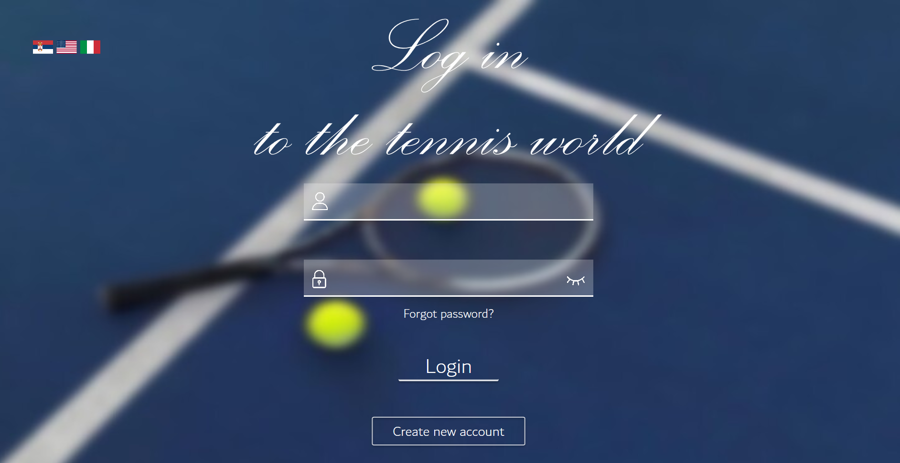
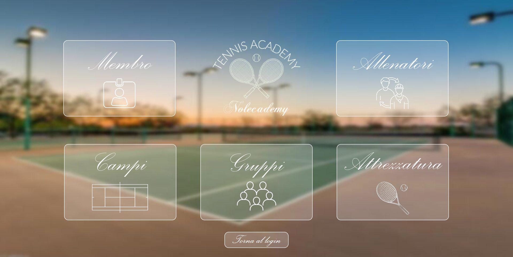
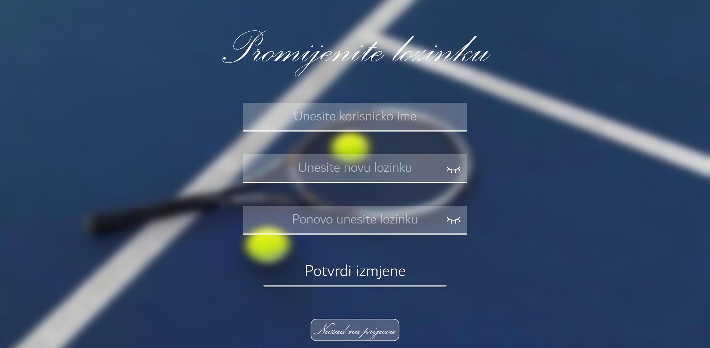
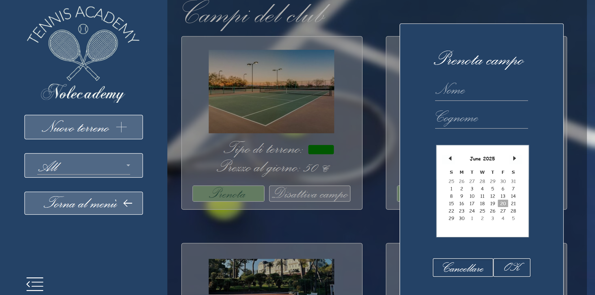
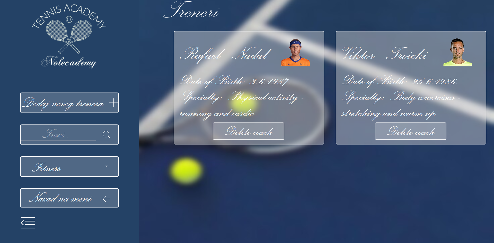
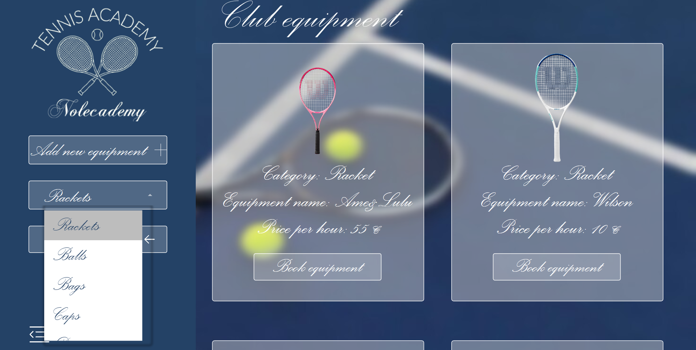
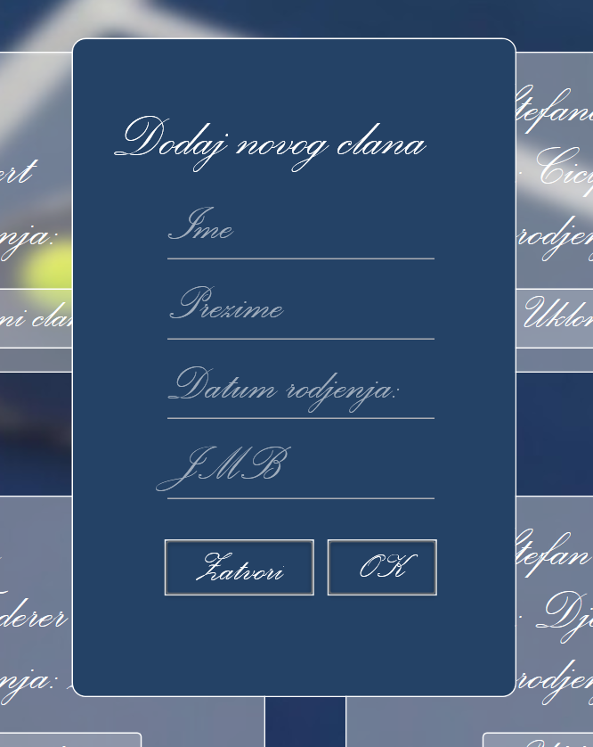
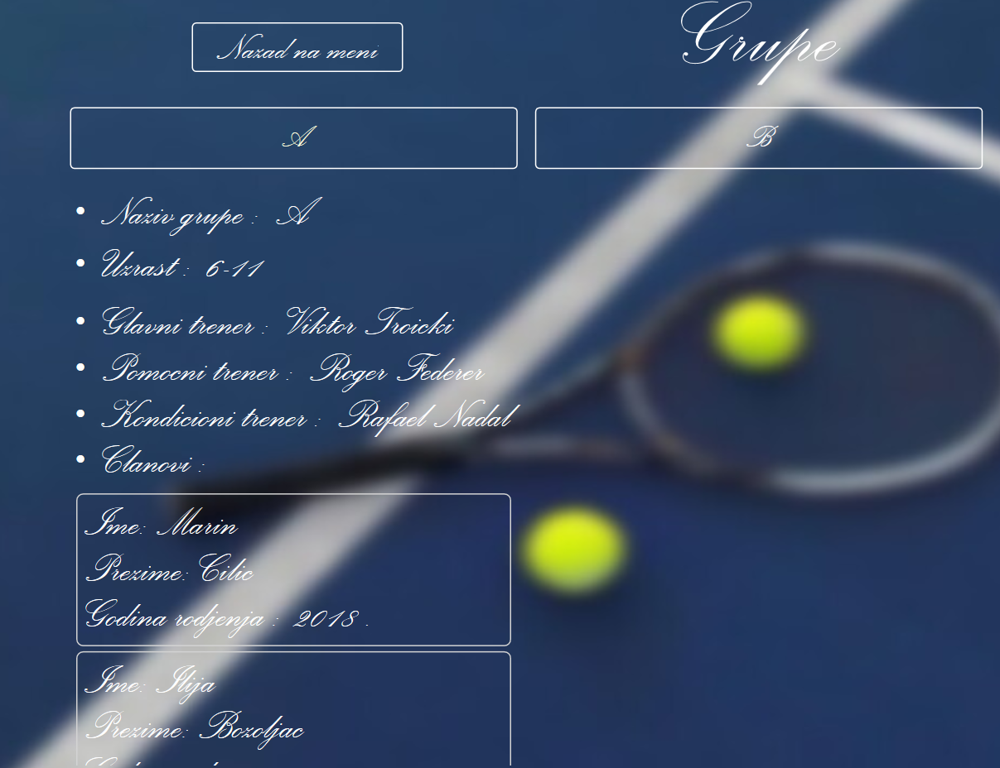

# 🎾 Tennis Club Management App

**Desktop aplikacija za upravljanje teniskim klubom**, razvijena u WPF (.NET), sa korištenom MySQL bazom podataka. Aplikacija pruža velik broj načina za evidentiranje i praćenje rada kluba, u smislu stalnog uvida u liste članova, kako pojedinačnih tako i grupisanih, te trenera, dostupnih terena i opreme koje je moguće iznajmiti na određeni period. Aplikacija je namijenjena svim interesantima tenisa kao sporta, koji ga praktikuju u rekreativne svrhe, ali i za same članove kluba (pri čemu se misli na polaznike i trenere), na način da, pored urednog pregleda onoga što klub sadrži, pruža mogućnost da svako ko praktikuje ovaj sport može da se oproba u željeno vrijeme na željenom mjestu sa vrhunskom opremom.
---

## 📋 Sadržaj

- [🚀 Pokretanje aplikacije](#-pokretanje-aplikacije)
- [🛠️ Funkcionalnosti](#️-funkcionalnosti)
- [📦 Tehnologije](#-tehnologije)
- [🌐 Podrška za više jezika](#-podrška-za-više-jezika)
- [📸 Screenshotovi](#-screenshotovi)
- [👩🏼‍💻 Autor](#-autor)

---

## 🚀 Pokretanje aplikacije

1. **Kloniranje repozitorijuma**
   
   ```bash git clone https://github.com/JelenaLaketa/TennisClub.git ```
  
2. **Navigiranje kroz folder TennisClub**
   
  Pretraga kloniranog foldera u cilju pronalaska odgovarajućeg .sln fajla u kojem je sadržan izvršni fajl.
  
3. **Otvaranje projekta u Visual Studio okruženju**

  Otvaranje Visual Studio okruženja, odabir opcije _Open a project or solution_, navigacija do kloniranog foldera TennisClub i otvaranje .sln fajla. 
  Pokretanje projekta.

---

## 🛠️ Funkcionalnosti

- ✅ Registracija članova i trenera na sistem 
    ➡️ Kreiranje naloga unosom potrebnih kredencijala - ime, prezime, te korisničko ime i lozinka koji će ubuduće biti korišteni pri prijavi na sistem.
- ✅ Prijava na sistem sa postojećim nalogom
    ➡️ Svaka iduća prijava na sistem sa ranije osmišljenim kredencijalima. Mogućnost promjene lozinke usljed takve želje ili potrebe korisnika.
- ✅ Mogućnost promjene lozinke
    ➡️ Unos korisničkog imena radi utvrđivanja postojanja naloga u bazi podataka i dvostruki unos novoosmišljene lozinke korisnika.
- ✅ Pregled članova kluba i upravljanje njihovim nalozima
    ➡️ Pregled osnovnih podataka o članovima kluba, sa mogućnošću sortiranja prema imenu, prezimenu ili datumu rođenja, kao i pretraga prema imenu i prezimenu.
        Mogućnost dodavanja novih članova u bazu podataka teniskog kluba.
- ✅ Pregled trenera kluba i upravljanje njihovim nalozima
    ➡️ Pregled osnovnih podataka o trenerima kluba, sa mogućnošću sortiranja prema imenu, prezimenu ili datumu rođenja, pretraga prema imenu i prezimenu, te filtriranje
        prema jednoj od tri uloge u teniskom klubu. Mogućnost dodavanja novih trenera u bazu podataka teniskog kluba.
- ✅ Pregled grupa članova kluba sa svim relevantnim informacijama o njima
    ➡️ Pregled grupa članova kluba sa relevantnim informacijama o grupi, poput uzrasne kategorije članova, njihovih ličnih podataka i dodijeljenim trenerima prema
        ulogama u klubu. Mogućnost kreiranja nove grupe sa svim potrebnim parametrima.
- ✅ Vizuelni i informativni pregled terena i opreme u vlasništvu kluba
    ➡️ Pregled galerije fotografija dostupnih terena i opreme u vlasništvu teniskog kluba. Terene je moguće filtrirati i pregledati na osnovu podloge
        koja ih karakteriše, dok je oprema podijeljena u nekoliko različitih kategorija. 
- ✅ Vršenje rezervacije terena i opreme u željenom periodu
    ➡️ Unosom ličnih podataka i odabirom željenog datuma, moguće je izvršiti rezervaciju željenog terena i opreme potrebne za trening na jedan dan, ukoliko
        već ne postoji rezervacija na taj dan od strane drugog teniskog interesanta.
- ✅ Višejezična podrška (Srpski (Latinica) / English / Italiano)
    ➡️ Pregled svih navedenih funkcionalnosti i sama interakcija sa sistemom na tri različita evropska jezika sa specifičnostima koje nose.
- ✅ Korištenje biblioteke ,,MaterialDesignInXamlToolkit"
    ➡️ Upotreba biblioteke ,,MaterialDesignInXamlToolkit" u velikoj mjeri je olakšala korištenje i primjenu gotovih komponenti u aplikaciji, na način da su,
        uz male izmjene prema ličnim afinitetima, razne komponente, ikone i slično upotrebljene u cilju što lakše interakcije korisnika sa aplikacijom.

---


## 📦 Tehnologije

- 🖥️ .NET
- 🖥️ WPF
- 🖥️ MySQL
- 🖥️ C#
- 🖥️ XAML
- 🖥️ MVVM šablon
- 🖥️ Material Design
- 🖥️ Github


---

## 🛠️ Podrška za više jezika

-Omogućen višejezični pregled sadržaja:
- 🇷🇸 srpski - latinica
- 🇺🇸 engleski - američki pravopis
- 🇮🇹 italijanski jezik.


---

## 📸 Screenshotovi
--Pregled korisničkog interfejsa kroz širi opseg mogućnosti u sklopu aplikacije.










---

## 👩🏼‍💻 Autor
- Ime i prezime: Jelena Laketa  
- GitHub profil: [github.com/JelenaLaketa](https://github.com/JelenaLaketa)  
- Izrada projektnog zadatka kao sastavni dio predmetnih obaveza na fakultetu.
